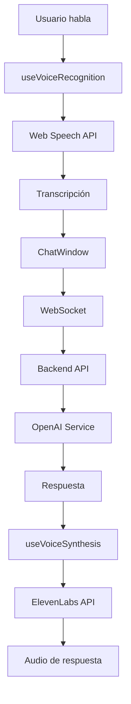

# 🤖 Prompt para Claude - Análisis e Implementación de Voz en PULSE-HUB

## 🎯 Objetivo del Análisis

Necesito que analices profundamente el código del agente conversacional en PULSE-HUB para identificar y solucionar el problema de detección de voz en dispositivos móviles. El sistema funciona correctamente en computadoras (local y deploy) pero **NO logra detectar voz desde teléfonos móviles** (local y deploy).

### 📱 Contexto del Problema

**Síntomas observados:**
- ✅ **PC (Comet browser)**: La detección de voz funciona perfectamente
- ❌ **Móvil (Chrome app)**: El frontend aparentemente escucha (muestra indicadores), pero **NO consigue grabar nada**
- 🔄 **Arquitectura actual**: API REST con WebSocket para comunicación en tiempo real
- 🌐 **Navegadores probados**: Comet (PC) vs Chrome (móvil)

## 🏗️ Arquitectura del Proyecto

### Estructura Principal
```
PULSE-HUB/
├── apps/
│   ├── api/          # Backend Express + TypeScript + WebSocket
│   └── web/          # Frontend Next.js + React
├── packages/
│   ├── shared/       # Tipos y utilidades compartidas
│   └── ui/           # Componentes UI reutilizables
└── agente-ia-conversacional-main/  # Implementación original de referencia
```

### Componentes Clave del Sistema de Voz

**Frontend (apps/web/src/shared/components/AIChat/):**
- `useVoiceRecognition.ts` - Hook para reconocimiento de voz con Web Speech API
- `useVoiceSynthesis.ts` - Hook para síntesis de voz (ElevenLabs)
- `ChatWindow.tsx` - Componente principal que integra ambos hooks
- `VoiceInterface.tsx` - Interfaz visual para interacción por voz

**Backend (apps/api/src/features/ai-chat/):**
- `ai-chat.service.ts` - Servicio principal del agente
- `openai-service.ts` - Integración con OpenAI GPT
- `server.ts` - WebSocket server para comunicación en tiempo real

## 🔍 Análisis Técnico Requerido

### 1. **Problema Principal: Detección de Voz en Móviles**

**Código a analizar:**
```typescript
// apps/web/src/shared/components/AIChat/useVoiceRecognition.ts
const getAudioConstraints = (): MediaStreamConstraints => {
  const isMobile = isMobileDevice();
  
  return {
    audio: {
      echoCancellation: true,
      noiseSuppression: true, // ✅ FIXED: Now enabled for mobile too
      autoGainControl: true,
      // Mobile-specific: Request high sample rate for better quality
      ...(isMobile && {
        sampleRate: { ideal: 48000 },
        channelCount: 1,
        latency: { ideal: 0 },
      }),
    },
  };
};
```

**Configuración actual del Speech Recognition:**
```typescript
// Configuración optimizada para móviles
recognition.lang = 'es-ES';
recognition.continuous = true; // ✅ FIXED: Always continuous for better mobile experience
recognition.interimResults = true;
recognition.maxAlternatives = 1;
```

### 2. **Problemas Identificados en la Documentación**

Según `apps/web/docs/MOBILE-VOICE-TROUBLESHOOTING.md`:

**Problemas comunes:**
- El indicador "🎤 Escuchando..." aparece pero no transcribe
- La consola muestra "🎤 Voice recognition started" pero no hay eventos de voz
- Permisos de micrófono denegados o mal configurados
- Micrófono en uso por otra aplicación

**Limitaciones técnicas conocidas:**
- Web Speech API requiere HTTPS (excepto localhost en desarrollo)
- iOS requiere iOS 14.5+ para Web Speech API
- El API no acepta directamente MediaStream como entrada
- Requiere conexión a internet activa

### 3. **Flujo de Comunicación Actual**



## 🎯 Preguntas Específicas para el Análisis

### 1. **Análisis de Compatibilidad Móvil**
- ¿La detección de dispositivos móviles en `isMobileDevice()` es precisa?
- ¿Los constraints de audio son apropiados para todos los navegadores móviles?
- ¿Hay diferencias en la implementación del Web Speech API entre Chrome móvil y desktop?

### 2. **Problemas de Permisos y Seguridad**
- ¿El manejo de permisos de micrófono es consistente entre plataformas?
- ¿Hay diferencias en el flujo de autorización entre navegadores?
- ¿Los errores de permisos se manejan correctamente en móviles?

### 3. **Optimizaciones Específicas para Móviles**
- ¿Los filtros de audio (echoCancellation, noiseSuppression, autoGainControl) funcionan igual en móviles?
- ¿La configuración de sampleRate y channelCount es óptima para dispositivos móviles?
- ¿El manejo de la latencia es apropiado para la experiencia móvil?

### 4. **Integración con la Arquitectura Existente**
- ¿El flujo WebSocket mantiene la compatibilidad con la detección de voz móvil?
- ¿Hay conflictos entre el sistema de síntesis (ElevenLabs) y el reconocimiento en móviles?
- ¿La implementación respeta la arquitectura Screaming Architecture del proyecto?

## 🔧 Soluciones a Evaluar

### Opción 1: Mejoras en la Implementación Actual
- Optimizar la detección de dispositivos móviles
- Ajustar constraints de audio específicos por plataforma
- Mejorar el manejo de errores y permisos
- Implementar fallbacks para navegadores con soporte limitado

### Opción 2: Implementación Alternativa
- Integrar una API de speech-to-text externa (Google Cloud, Azure)
- Implementar detección de voz híbrida (local + cloud)
- Usar WebRTC para mejor control del audio en móviles

### Opción 3: Optimización de la Arquitectura
- Separar la lógica de voz en un servicio independiente
- Implementar cache de audio para mejorar la experiencia móvil
- Añadir métricas y monitoreo específico para móviles

## 📋 Entregables Esperados

### 1. **Análisis Detallado**
- Identificación precisa de la causa raíz del problema
- Evaluación de la compatibilidad actual con diferentes navegadores móviles
- Análisis de la arquitectura y posibles puntos de falla

### 2. **Propuesta de Solución**
- Solución recomendada que respete la arquitectura existente
- Código específico con las modificaciones necesarias
- Plan de implementación paso a paso

### 3. **Consideraciones Adicionales**
- Impacto en la experiencia de usuario
- Compatibilidad con la API REST actual
- Consideraciones de rendimiento y escalabilidad
- Plan de testing y validación

## 🚨 Restricciones Importantes

1. **Mantener la arquitectura actual**: No cambiar la estructura de API REST + WebSocket
2. **Preservar funcionalidad existente**: La solución no debe romper el funcionamiento en PC
3. **Compatibilidad**: Debe funcionar en los navegadores móviles más comunes
4. **Rendimiento**: No debe impactar significativamente la latencia o el uso de recursos
5. **Mantenibilidad**: El código debe ser fácil de mantener y extender

## 📚 Archivos de Referencia Clave

- `apps/web/src/shared/components/AIChat/useVoiceRecognition.ts` - Implementación principal
- `apps/web/src/shared/components/AIChat/ChatWindow.tsx` - Integración
- `apps/web/docs/MOBILE-VOICE-TROUBLESHOOTING.md` - Documentación de problemas
- `VOICE_TROUBLESHOOTING.md` - Guía general de troubleshooting
- `SOLUCION_CHAT_VOZ.md` - Soluciones previas implementadas

## 🎯 Resultado Esperado

Al final del análisis, necesito:
1. **Una solución clara y específica** que resuelva el problema de detección de voz en móviles
2. **Código implementable** que pueda aplicar directamente al proyecto
3. **Documentación actualizada** con las mejores prácticas para móviles
4. **Plan de testing** para validar la solución en diferentes dispositivos

---

**¿Puedes analizar el código y proporcionar una solución detallada para este problema de detección de voz en móviles?**

